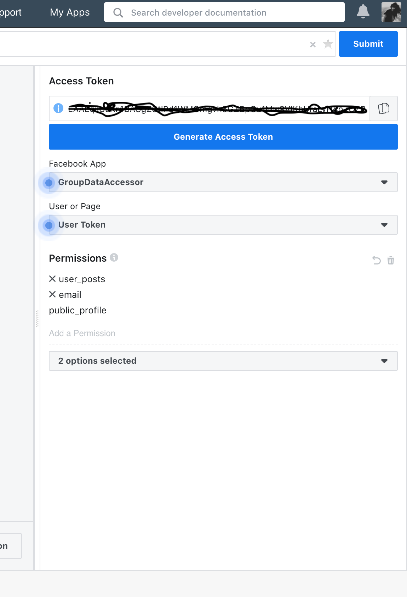

# Automation-with-Python

The sample code in this python file is written to fetch the response data from `/feed` page of a group (either public or private) using [Graph API Explorer](https://developers.facebook.com/)
Once you will have the `/feed` data, you can manipulate post's for whatever the purpose you want. For example, you can delete the post automatically if it contains some inappropriate words etc.

# Technology Stack
 - Python 
 - Facebook Graph API
 
 
# Prerequisites  
- User/group/page access token generated with admin rights from Graph API Explorer 
- Python libraries json and requests 

# Steps to get the Access token from Graph Access API:

1. Goto https://developers.facebook.com/ while logged in from your facebook account.
2. `Ceate new app` by clicking on your profile picture options on the top right. 
3. Give app name and fill out other info if you are required.
4. App will be opned, complete the `grant access wizard` and copy the generated access token.

Ensure that you will select some permissions from the dropdown below the generated token, I required to add `user_posts` permission as I'm fetching `feed` data. Adding permission is shown in the image below:

I could have directly used functions from python's GraphAPI (*from facepy import GraphAPI*) to get the response object. However, for this sample I have used request library only. 

